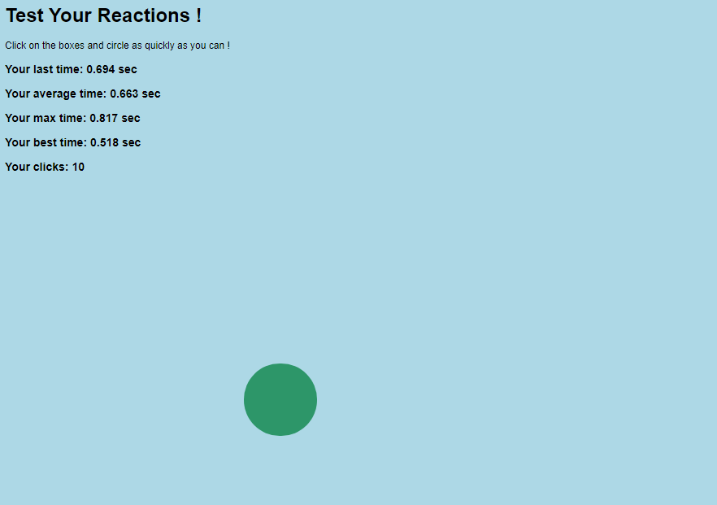

# ReactionTester

### Project developed in: html, css and javascript. 

*Displays random shapes with random colors one after the other and calculates the **reaction time** as soon as the user clicks the shape*

